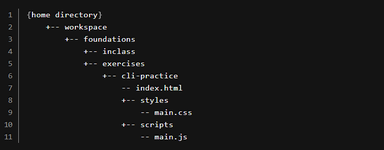

#### 📝 ASSIGNMENT
# 01. CLI Practice

## Create Class Directories and Files

Before you start writing code for any application, you want to set up the directory structure and create some initial files on the file system first.

Since all of the work you will be doing at NSS will be contained in the `~/workspace` directory, you need to create a `foundations` subdirectory.

If you don't have a workspace directory yet, go to your terminal, type `cd` and press enter to get to your home directory. Then `mkdir workspace`. Then you can `cd workspace`.

Create the `foundations` directory inside the workspace directory.

In the `foundations` directory, we will create two more directories: `inclass` and `exercises`.

Once we are all setup, our directory structure will look like this:

## Let's Start!
