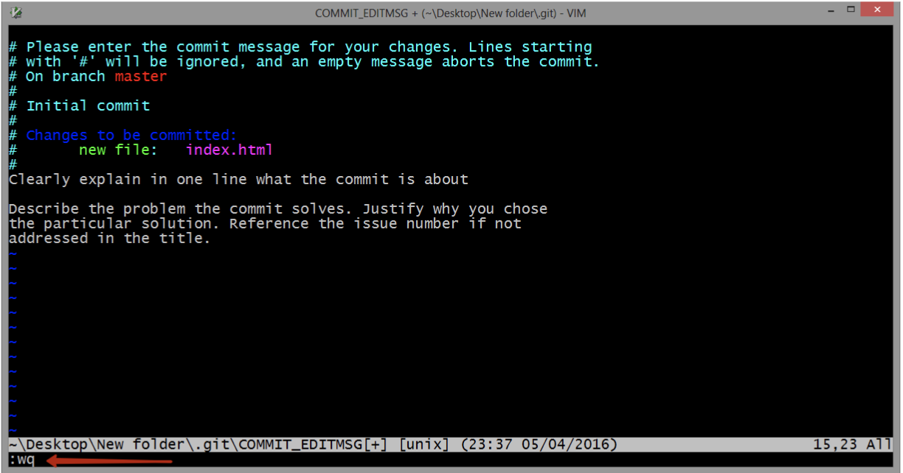

#### 💻 CODE ALONG
# 01. Command Line Interface (CLI)

## Introduction

The command line is a text based interface that allows you to control your computer. You can use it to navigate your machine’s file structure and perform commands that you can't using just your computers file explorer. Becoming comfortable with your terminal will make you a master of the computer.

## Tools

- Mac Users: You will be using an application called Terminal
- Windows Users: You will be using Windows Terminal
- OPTIONAL (Mac and Windows): VSCode Integrated Terminal No matter if you use the terminal applications on your computer or the integrated terminal, commands will run the same.

**Rule #1 of Command Line:**

Always know where you are `pwd`

**Basic Commands**

- `cd` - change directory.
- `pwd` - print working directory; show where you are.
- `mkdir` - make directory.
- `ls` - list contents of a directory.
- `clear` - clear the view.
- `touch` - create file.
- `rm` - remove a single file
- `rm -rf` - remove a directory and all of its contents
- `code .` - opens the current directory in VS code.

## ASSIGNMENT

[Command Line Interface - Youtube Video](https://www.youtube.com/watch?v=zCtjYlNH7-8&ab_channel=Dr.TeresaVasquez)

## NOTE: VIM

If you see this don't panic:

- hit escape
- type :wq
- hit enter
