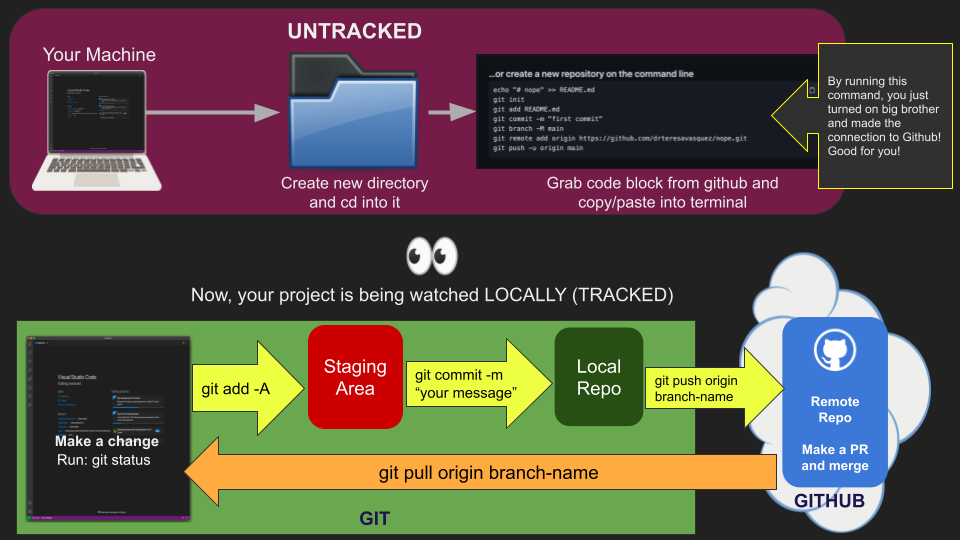

#### ↩️ REVIEW/NOTES
# 03. Intro to Git/Github with Cheatsheet

This week we are going to learn how to use Git, Github and branching by using VS Code and our terminals.

Feel free to ask questions pertaining to the content and things we specifically worked on.

## Why Are You Learning This?

As a professional developer, you will be working on a team. Modern software development is a team sport, not an individual one. Team members need the ability to write code independently, but then merge their individual code together when it's time to release a version of the software.

Git is the tool to allow a developer to work on an independent branch of the code base, and then merge in the work of others. Github is a tool which allows you to easily share your code with other people, regardless of where they are located.

## Vocabulary:

- **Git:** allows you to keep track of changes made to your code. it is the most widely used version control software out there. It is considered a modern development standard. Sometimes it is referred to as distributed version control - this means work is done on a local computer and then pushed to the remote source of truth.

- **GitHub:** This is a web-based utility that hosts/stores Git Repository information. It makes team collaboration easy. It also is a record of what you have done at NSS - all your code is tracked and timestamped. Looking at your GitHub over the course of 12 months will tell employers how you have grown.

- **Repository (repo):** folder that contains your source code

- **main:** the branch where the source code is the most complete. On creation, your local repository will always be on the master branch. We change that from master to main to match Github.

- **local:** refers to your personal machine. ‘Local changes’ are modifications that you have made and committed, but have not pushed to an external store (for us, Github).

- **remote:** refers to the remote servers/machines that store changes and allow for those changes to be pulled down/cloned onto another's machine.

## Backing Up and Sharing Code on Github

Github is a software as a service (SAAS) that allows you to back up your repository to the cloud and share it with other software developers. Note that it is not the same thing as git, which is an application you are running locally on your machine. Github and git are made to talk to each other, but they are separate entities.

## What is difference between Git and Github?

- **Git:** allows you to keep track of changes made to your code. it is the most widely used version control software out there. It is considered a modern development standard. Sometimes it is referred to as distributed version control - this means work is done on a local computer and then pushed to the remote source of truth.

- **GitHub:** This is a web-based utility that hosts/stores Git Repository information. It makes team collaboration easy. It also is a record of what you have done at NSS - all your code is tracked and timestamped. Looking at your GitHub over the course of 12 months will tell employers how you have grown.

## Basic Git Flow:

## Basic Git Commands

Get git status - this tells you what has changed in your repository since the last time you committed. This will be your favorite command

> `git status`

Add files to git - allows you to individually add files you want to package up

> `git add index.html`

Commit files to git - allows you to package up all the things you added and take a snapshot. You should add a meaningful message to your commit.

> `git commit -m "added in a navbar"`

Push to remote - pushes any commits you have made up to your remote (in our case up to github). With this command you specify what branch you are pushing to.

> `git push origin main`

Clone repo - this is how you pull down an existing repository.

> `git clone [repo ssh link]`

## Resources

- [Git Cheatsheet](https://drive.google.com/file/d/1U30BWdj91VoOGpG9pRvMUf-G9_TleqxH/view?usp=sharing)
